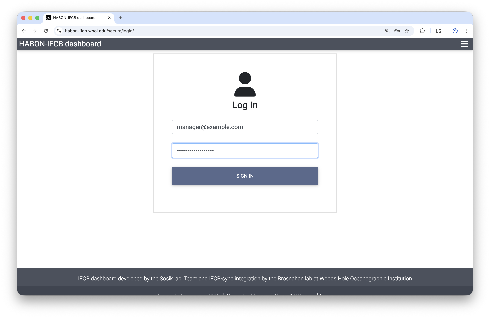
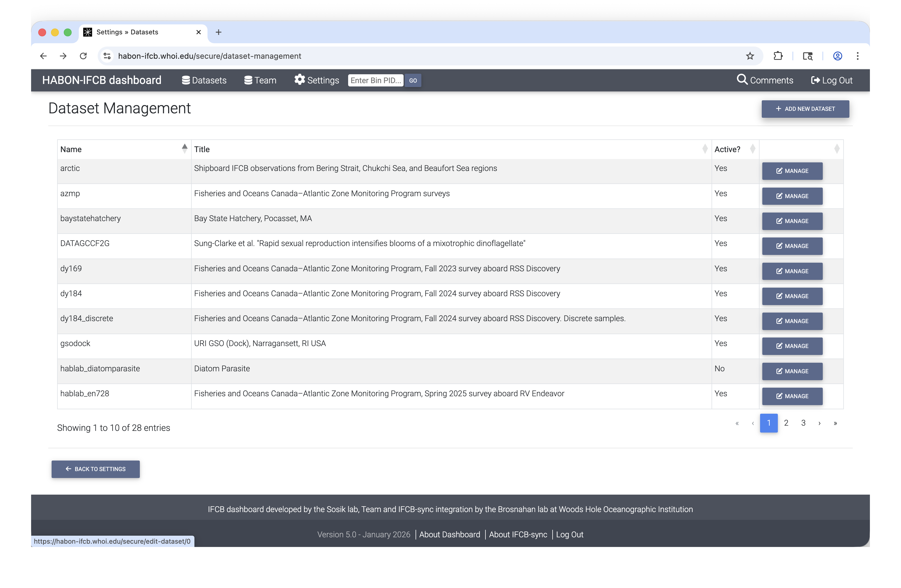
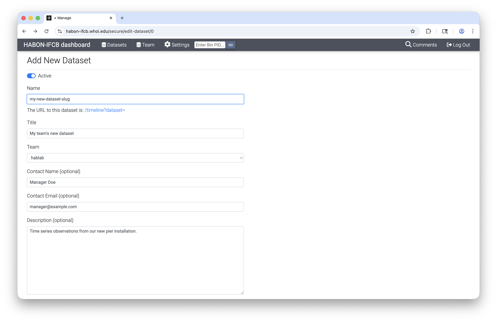
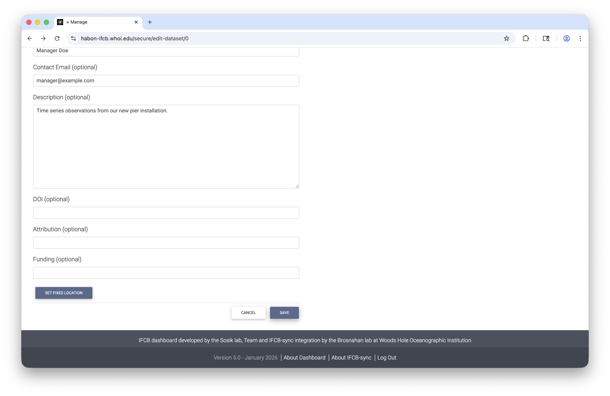
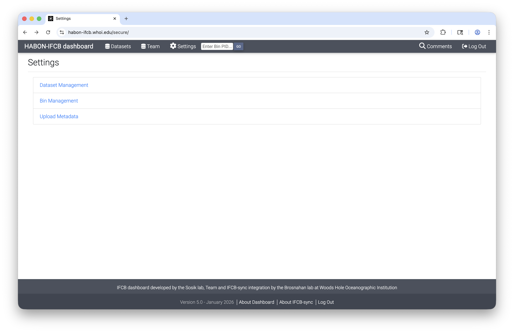
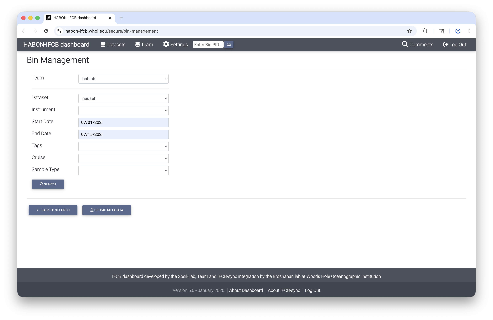
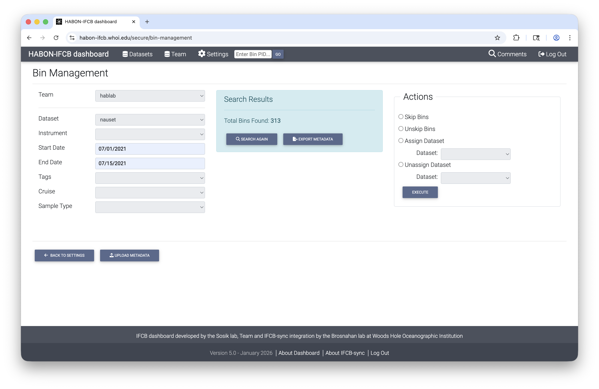
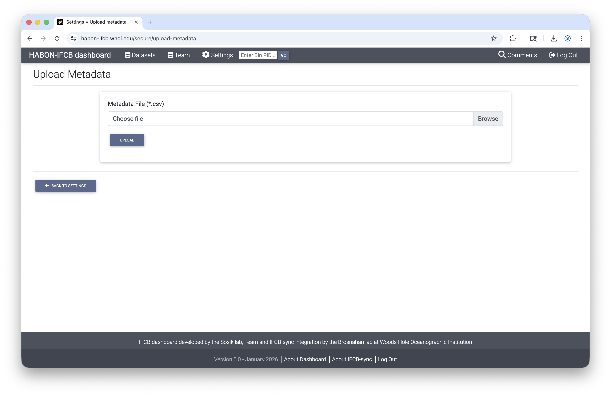

# IFCB Sync

IFCB Sync allows Imaging FlowCytobot ([IFCB](https://mclanelabs.com/imaging-flowcytobot/)) operator groups to share their data through an [IFCB dashboard](https://github.com/WHOIGit/ifcbdb.git) hosted at the Woods Hole Oceanographic Institution (https://habon-ifcb.whoi.edu). Depending on how it's invoked, the program either performs a one-time file synchronization or continuosly monitors a specified data directory, uploading any new files created within the directory to habon-ifcb.whoi.edu via an AWS-based pipeline.

## Table of Contents
[Installation procedure](#installation-procedure)

[How to use](#how-to-use)

[Dataset creation in HABON IFCB dashboard](#dataset-creation-in-habon-ifcb-dashboard)

[Data management in HABON IFCB dashboard](#data-management-in-habon-ifcb-dashboard)


## Installation procedure

IFCB sync can be installed either directly on an IFCB sensor running Debian Linux or on a separate server running Debian Linux, macOS, or Windows. The installation steps are almost identical across these operating systems. Differences are described within the sections below under the subheadings for each OS.

### 1. Contact mbrosnahan@whoi.edu to request a IFCB Dashboard account and receive access credentials.

A new Team account will be created allowing members of your operator group to log into the [HABON IFCB dashboard](https://habon-ifcb.whoi.edu) where you can create new dataset endpoints, organize and move files between datasets, management team membership, and update sample metadata. 

You will also receive separeate AWS credentials for use with the ifcb-sync tool as described below.

### 2. Ensure that Git is installed on your host.

#### Linux

In a terminal:

```
sudo apt update
sudo apt install git
```

#### Mac

Download and install Xcode through the [Mac App store](https://apps.apple.com/us/app/xcode)

#### Windows

Download and install [Git for Windows](https://git-scm.com/download/win). During installation, be sure to enable symbolic links.

### 3. Install the `ifcb-sync` script.

#### IFCB sensor installation

In a terminal:

```
cd /home/ifcb
git clone https://github.com/WHOIGit/ifcb-sync.git
cd ifcb-sync
chmod +x ifcb-sync
sudo ln -s /home/ifcb/ifcb-sync/ifcb-sync /usr/local/bin/
```

#### Linux and MacOS server installations

In a terminal:

```
git clone https://github.com/WHOIGit/ifcb-sync.git
cd ifcb-sync
INSTALLDIR=$(pwd)
chmod +x ifcb-sync
sudo ln -s "$INSTALLDIR/ifcb-sync" /usr/local/bin/
```

#### Windows server installation

Open a terminal windown in `Git Bash` using 'as an Administrator' option. Right click icon in start menu > 'More' > 'Run as administrator'.
In the terminal window:

```
git clone https://github.com/WHOIGit/ifcb-sync.git
cd ifcb-sync
chmod +x ifcb-sync
mkdir -p /usr/local/bin
```

Create a Windows symlink for ifcb-sync.
Open and run `cmd.exe` as an administrator, then in the new terminal window:

```
cd C:\Program Files\Git\usr\local\bin
mklink ifcb-sync C:\path\to\ifcb-sync\ifcb-sync
```

where `C:\path\to\ifcb-sync` is the location where this repo was cloned. Default is `C:\Users\USERNAME\ifcb-sync`.

### 4. Create a new `.env` file in the same directory. In a terminal, copy the example code from the `.env.example`. Use Git Bash terminal if installing on a Windows host.

```
cp .env.example .env
```

### 5. Update the .env variables to the AWS Key/AWS Secret/User Account that you received from WHOI using a text editor (e.g., `nano .env`).

```
AWS_ACCESS_KEY_ID=your-key-here
AWS_SECRET_ACCESS_KEY=your-secret-here
USER_ACCOUNT=your-user-account
```

## How to use

The `ifcb-sync` script main commands:

### ifcb-sync start <target_directory> <target_time_series>

- Start the IFCB file watcher as a background process. Once the script is started, it will sync all existing files and then continue to monitor the specified data directory for any new files. You can also monitor the script output in the `ifcb-file-watcher.log` file.

- <target_directory> - This is the absolute or relative path to the root of the data directory for the IFCB files: ex. `/home/ifcb/ifcbdata`

- <target_time_series> - The name of the time series you want to add these files to on the IFCB Dashboard: `my-dataset`. 

**IMPORTANT: The time series name must be created within the [IFCB Dashboard](https://habon-ifcb.whoi.edu) before you attempt 'start' or 'sync'.**

Data are only shared if <target_time_series> is associated with the installed USER_ACCOUNT. 

### ifcb-sync stop <target_directory|target_time_series>

- Stops running processes associated with the target directory or time series. You only need to supply one of the options.

### ifcb-sync list

- List all the existing Time Series in your account.

## Live data sharing example:

A member of group `hablab` deploys an IFCB and wants to publish its images through time series `nauset`. Their data are written to directory `/home/ifcb/ifcbdata/nauset_data` on their IFCB. To start sharing lived data, they first confirm that `nauset` dataset has been created through the HABON IFCB dashboard either by going to the dashboard in a browser to confirm or using `ifcb-sync list`.

Once confirmed, live data sharing is started using command:

```
ifcb-sync start /home/ifcb/ifcbdata/nauset_data nauset
```

Images will be transferred through AWS and published at https://habon-ifcb.whoi.edu/nauset as sample bins are written to disk on the IFCB.

Before the instrument is taken offline or used for creation of another dataset, they should stop `ifcb-sync` using command:

```
ifcb-sync stop nauset
```

Failure to stop `ifcb-sync` may cause future IFCB samples to be added mistakenly to the `nauset` time series.

## One-time sync option

### ifcb-sync sync <target_directory> <target_time_series>

If you just need to upload or sync an existing group of data files in a directory, you can run the script in "one-time sync" mode. This operation will end the program after existing files are transferred the https://habon-ifcb.whoi.edu. It will not monitor the directory for new files.

### Notes on data transfers

IFCB data are transferred from your IFCB or data server to WHOI's cloud storage. Files in the target directory **and its subdirectories** not already present in the cloud will be uploaded and synced to the specified time-series. However, if files are removed or deleted from the target directory there ifcb-sync is running, these chagnes are not propgated to the time series on https://habon-ifcb.whoi.edu. Updates to the published time series need to be made by logging into the IFCB dashboard website and using Bin Management or Dataset Management tools available under Settings.

## Dataset creation in HABON IFCB dashboard

To transfer and display data on the HABON IFCB dashboard, users must create the <target_time_series> through the following steps:

First, log into [HABON dashboard](https://habon-ifcb.whoi.edu/secure/login/) using your email address and password. There is also a 'Log In' link available within the footer of all IFCB dashboard pages.


Once logged in, a new menu called Settings will be revealed. Click Dataset Managment to view a list of previously created datasets.


Next, click 'Add New Dataset' and enter details.


The 'Name', 'Title', and 'Team' fields are required. 

Name is used as a slug in unique URLs associated with the dataset. It cannot contain spaces but can contain special characters '-', '.', '_', and '~'. Name must also be unique. If a previously taken name is entered, it will be rejected when attempting to save the new dataset. 

Title is a human-readable description of the dataset. This field can contain puncuation.

'Team' should be assigned. In most cases, users will only have one Team available in the drop down menu.

A fixed location or depth can be entered for the time series by scrolling to the bottom of the 'Add New Dataset' page and clicking the 'Set Fixed Location' button. 

**The dataset is not created until the user clicks Save at the bottom of the Add New Dataset page.**



## Data management in HABON IFCB dashboard

IFCB dashboard allows users to update the organization of data and revise critical metadata associated with individual IFCB samples or 'bins'. An IFCB bin is the collection of images recorded from a single water sample. By default, individual bins are assigned a collection time and volume analyzed by the IFCB sensor. Bins may also have latitude, longitude, depth, and other metadata assigned by the IFCB sensor if the sensor is pre-configured to assign them (e.g., when operated as part of a [PhytO-ARM](https://github.com/WHOIGit/PhytO-ARM) system).

### Bin Management

Bins are added to HABON IFCB dashboard with an initial dataset assignment by IFCB-sync. These assignments may be revised using Bin Management. Users also have the option of associating single bins with multiple datasets.

To access Bin Management, log into [HABON IFCB dashboard](https://habon-ifcb.whoi.edu/secure/login/) as above. Then go click the Settings menu and select Bin Managment.


The Bin Managment page guides users through three steps. The first is bin filtering. Select a team, then further refine the selection of bins using 'Dataset', 'Instrument', 'Start Date', 'End Date', 'Tags', 'Cruise', and 'Sample Type' fields. 


Once all desired filters have been set, click 'Search'. This will reveal a summary of the selected set of bins and an action pane that for applying or removing skip flag and dataset assignments.


Users have the option of downloading a CSV file that lists each of the selected bins and their associated metadata by clicking 'Export Metadata'. The CSV is pre-formatted for re-upload with modified values. 

### Metadata modification

To change metadata, users should open the CSV downloaded through 'Export Metadata' with a spreadsheet application. 

Fields in columns `sample_time`, `ml_analyzed`, `latitude`, `longitude`,	`depth`,	`cruise`, `cast`,	`niskin`,	`sample_type`,	`tag1`, `comment_summary`, and `skip` may be changed. Acceptable entries for these fields are as follows:

| IFCB dashboard metadata | Format | Example | Note |
| --- | --- | --- | :--- |
| `sample_time` | ISO-8601 datetime with timezone offset | 2024-07-21 14:35:00+00:00 | |
| `ml_analyzed` | Positive float (>0) | 3.56 | N.B. this value should NOT equal sample volume set in IFCBacquire |
| `latitude` | Decimal degrees | 41.5234 | Optional |
| `longitude` | Decimal degrees | -70.6712 | Optional |
| `depth` | m, positive downward | 3.5 | Optional |
| `cruise` | String (no whitespace) | dy184 | Optional |
| `cast` | String (no whitespace) | 12 | Optional |
| `niskin` | String (no whitespace) | 3 | Optional |
| `sample_type` | String (no whitespace) | formalin-fixed | Optional |
| `tag1` | String (no whitespace) | expt1 | Additional tags may be assigned using additional columns `tag2`, `tag3`, etc. |
| `comment_summary` | String | Intercalibration sample set | |
| `skip` | Binary (0 or 1; default is 0) | 0 | Assign 1 to compromised samples (e.g., bad flow) |

Fields in columns `pid`, `ifcb`, and `n_images` are fixed and will not be modified in the IFCB dashboard database if altered. 

The user should save the updated spreadsheet in CSV format. They may then transfer their updates to the dashboard by reupload the modified CSV file. To do this, click the 'Upload Metadata' button at the bottom of the Bin Management page or in the menu provided by clicking 'Settings'.


### Dataset and `skip` assignment

Dataset and `skip` assignments may also be done using the 'Actions' pane after Search in the Bin Managment page. Only one action may be completed at a time. If assigning or unassigning a dataset, the user must also select from the list of available datasets in the dropdown list.
[action example](ifcbdb_screenshots/action.png)
