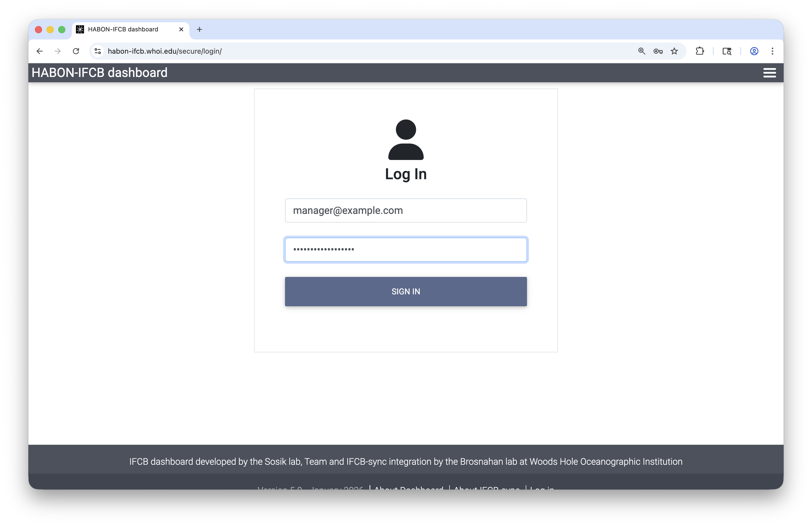
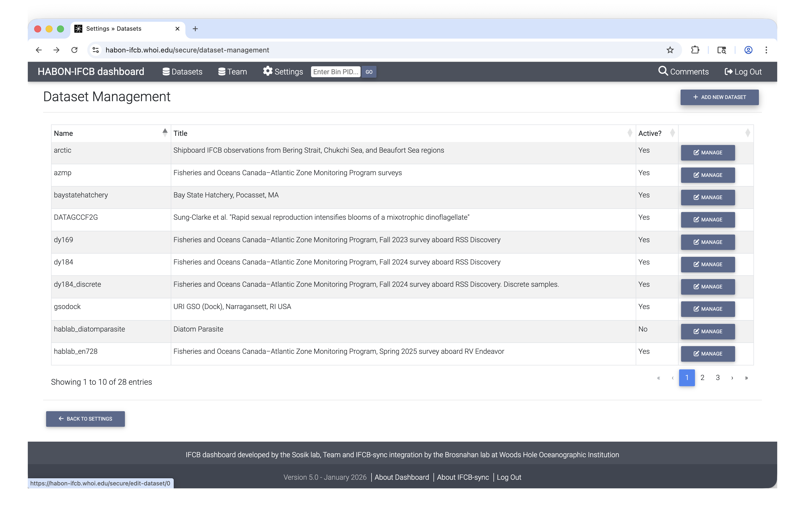
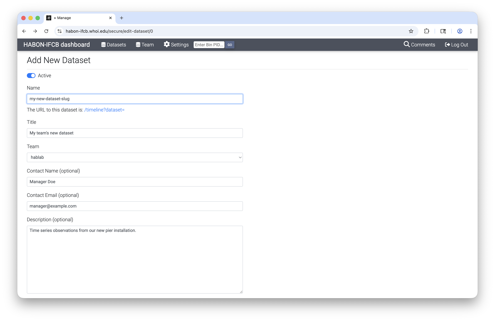
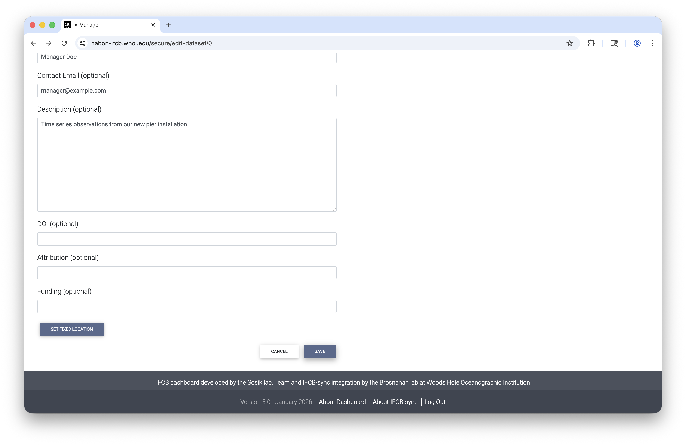
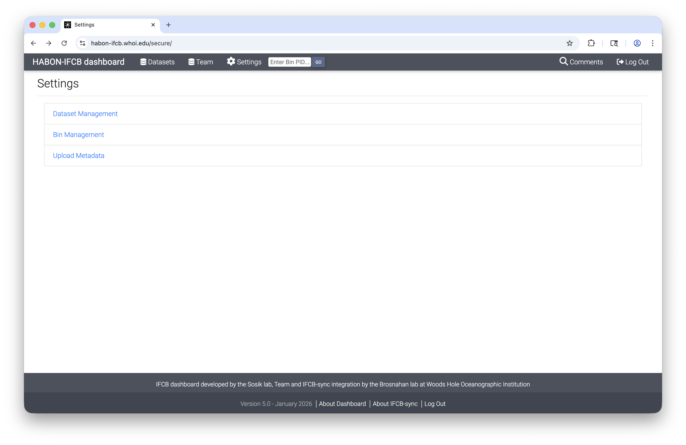
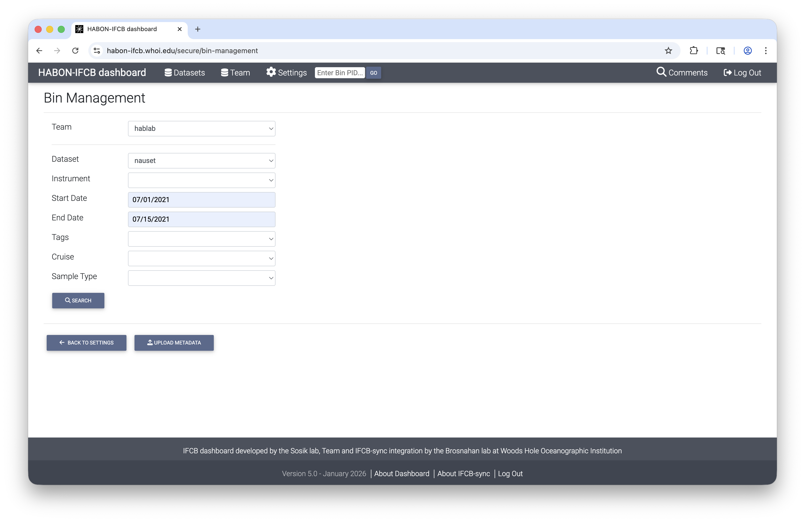
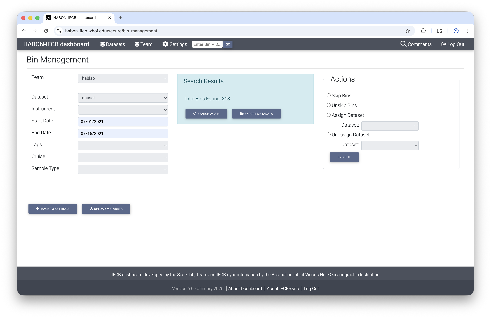
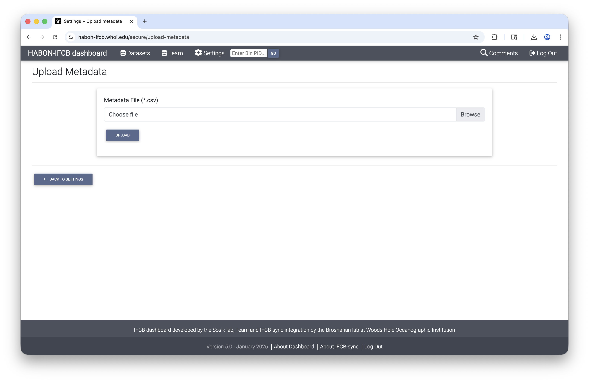

# Dashboard Administration

## Dataset creation in HABON IFCB dashboard

To transfer and display data on the HABON IFCB dashboard, users must create the <target_time_series> through the following steps:

First, log into [HABON dashboard](https://habon-ifcb.whoi.edu/secure/login/) using your email address and password. There is also a 'Log In' link available within the footer of all IFCB dashboard pages.

Once logged in, a new menu called Settings will be revealed. Click Dataset Managment to view a list of previously created datasets.

Next, click 'Add New Dataset' and enter details.

The 'Name', 'Title', and 'Team' fields are required. 

Name is used as a slug in unique URLs associated with the dataset. It cannot contain spaces but can contain special characters '-', '.', '_', and '~'. Name must also be unique. If a previously taken name is entered, it will be rejected when attempting to save the new dataset. 

Title is a human-readable description of the dataset. This field can contain puncuation.

'Team' should be assigned. In most cases, users will only have one Team available in the drop down menu.

A fixed location or depth can be entered for the time series by scrolling to the bottom of the 'Add New Dataset' page and clicking the 'Set Fixed Location' button. 

**The dataset is not created until the user clicks Save at the bottom of the Add New Dataset page.**

## Data management in HABON IFCB dashboard

IFCB dashboard allows users to update the organization of data and revise critical metadata associated with individual IFCB samples or 'bins'. An IFCB bin is the collection of images recorded from a single water sample. By default, individual bins are assigned a collection time and volume analyzed by the IFCB sensor. Bins may also have latitude, longitude, depth, and other metadata assigned by the IFCB sensor if the sensor is pre-configured to assign them (e.g., when operated as part of a [PhytO-ARM](https://github.com/WHOIGit/PhytO-ARM) system).

### Bin Management

Bins are added to HABON IFCB dashboard with an initial dataset assignment by IFCB-sync. These assignments may be revised using Bin Management. Users also have the option of associating single bins with multiple datasets.

To access Bin Management, log into [HABON IFCB dashboard](https://habon-ifcb.whoi.edu/secure/login/) as above. Then go click the Settings menu and select Bin Managment.

The Bin Managment page guides users through three steps. The first is bin filtering. Select a team, then further refine the selection of bins using 'Dataset', 'Instrument', 'Start Date', 'End Date', 'Tags', 'Cruise', and 'Sample Type' fields. 

Once all desired filters have been set, click 'Search'. This will reveal a summary of the selected set of bins and an action pane that for applying or removing skip flag and dataset assignments.

Users have the option of downloading a CSV file that lists each of the selected bins and their associated metadata by clicking 'Export Metadata'. The CSV is pre-formatted for re-upload with modified values. 

### Metadata modification

To change metadata, users should open the CSV downloaded through 'Export Metadata' with a spreadsheet application. 

Fields in columns `sample_time`, `ml_analyzed`, `latitude`, `longitude`,	`depth`,	`cruise`, `cast`,	`niskin`,	`sample_type`,	`tag1`, `comment_summary`, and `skip` may be changed. Acceptable entries for these fields are as follows:

| IFCB dashboard metadata | Format | Example | Note |
| --- | --- | --- | :--- |
| `sample_time` | ISO-8601 datetime with timezone offset | 2024-07-21 14:35:00+00:00 | |
| `ml_analyzed` | Positive float (>0) | 3.56 | N.B. this value should NOT equal sample volume set in IFCBacquire |
| `latitude` | Decimal degrees | 41.5234 | Optional |
| `longitude` | Decimal degrees | -70.6712 | Optional |
| `depth` | m, positive downward | 3.5 | Optional |
| `cruise` | String (no whitespace) | dy184 | Optional |
| `cast` | String (no whitespace) | 12 | Optional |
| `niskin` | String (no whitespace) | 3 | Optional |
| `sample_type` | String (no whitespace) | formalin-fixed | Optional |
| `tag1` | String (no whitespace) | expt1 | Additional tags may be assigned using additional columns `tag2`, `tag3`, etc. |
| `comment_summary` | String | Intercalibration sample set | |
| `skip` | Binary (0 or 1; default is 0) | 0 | Assign 1 to compromised samples (e.g., bad flow) |

Fields in columns `pid`, `ifcb`, and `n_images` are fixed and will not be modified in the IFCB dashboard database if altered. 

The user should save the updated spreadsheet in CSV format. They may then transfer their updates to the dashboard by reupload the modified CSV file. To do this, click the 'Upload Metadata' button at the bottom of the Bin Management page or in the menu provided by clicking 'Settings'.

### Dataset and `skip` assignment

Dataset and `skip` assignments may also be done using the 'Actions' pane after Search in the Bin Managment page. Only one action may be completed at a time. If assigning or unassigning a dataset, the user must also select from the list of available datasets in the dropdown list.
[action example](../ifcbdb_screenshots/action.png)
