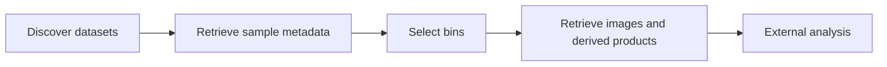
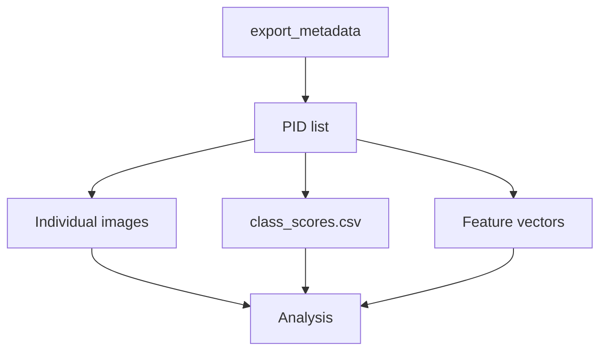

# Accessing Dashboard Data

## Overview

IFCB Dashboard provides a URL-based web API for discovering datasets and retrieving IFCB data programmatically.

Most automated workflows follow the sequence



The API is organized around three levels of data organization:

- datasets
- bins (samples)
- individual images

Derived products such as classifier outputs and image feature matrices are currently retrieved at the **bin** level.

---

# Discover datasets

List all public datasets

```
https://habon-ifcb.whoi.edu/api/list_datasets
```

Restrict results to a Team

```
https://habon-ifcb.whoi.edu/api/list_datasets/nwfsc
```

These URLs return a JSON object containing array "datasets"
```
{"datasets": ["buddinlet", "nwfsc_pacific_hake_survey"]}
```

Subsequent API requests must use one of these dataset names.

---

# Retrieve sample metadata

The primary API endpoint for discovering samples is

```
/api/export_metadata/<dataset>
```

For example

```
https://habon-ifcb.whoi.edu/api/export_metadata/buddinlet
```

returns a CSV containing one row for every IFCB sample in the dataset.

The exported table list bin pids and select associated metadata, including:

- sample collection time (`sample_time`)
- ifcb (unit number)
- sample volume analyzed (`ml_analyzed`)
- latitude
- longitude
- depth
- cruise
- cast
- niskin
- sample type (`sample_type`)
- number of images (`n_images`)
- comments (`comment_summary`)
- particle detection configuration (`trigger_selection`)
- binary quality assessment (`skip`, exclude if equal to 1)

The `dataset` and `pid` fields returned by this endpoint are used to construct URLs for retrieving additional data products.

> **Note**
>
> The `api/export_metadata` endpoint returns similar, but not identical information as provided by the **Export Metadata** action available through the Dashboard [**Bin Management** interface](docs/dashboard.md#bin-management). The API provides a convenient mechanism for scripting and automated analyses.

---

# Filter by date

Metadata queries may be restricted using

```
start_date
end_date
```

Datetimes are specified in ISO 8601 format:

```
yyyy-MM-dd
```

or

```
yyyy-MM-dd'T'HH:mm:ss
```

Example

```
https://habon-ifcb.whoi.edu/api/export_metadata/harpswell?start_date=2021-07-01T01:23:45&end_date=2021-07-02T12:34:56
```

All times are interpreted as UTC and filtering is performed using the `sample_time` metadata field.

---

# Access individual images

Each image within a bin has a stable URL. Image names are constructed by appending the ROI index number to the Bin ID. The ROI index number is represented as a five-digit, zero-padded integer. Complete image names are provided in class files as pid. In feature and ADC files, ROI index numbers (but not complete image names) are provided in the first column of data. 


Example dashboard page:

```
https://habon-ifcb.whoi.edu/image?image=06582&dataset=harpswell&bin=D20210701T152144_IFCB124
```


Direct download of a PNG image:

```
https://habon-ifcb.whoi.edu/harpswell/D20210701T152144_IFCB124_06582.png
```

Direct download of a JPEG image:

```
https://habon-ifcb.whoi.edu/harpswell/D20210701T152144_IFCB124_06582.jpg
```


---

# Access bin-level derived products

Classifier outputs, features, and other derived products are currently published as **bin-level** files.

For example

```
https://habon-ifcb.whoi.edu/harpswell/D20210701T152144_IFCB124_class_scores.csv
```

contains classifier scores for every ROI image in the sample.

Similarly, feature vector files contain one row per ROI image describing image morphology and optical properties.

The first column of these files identifies the corresponding ROI, allowing results to be linked back to individual images.

Because these products summarize an entire sample, they are retrieved using the **dataset** and **PID** rather than individual image URLs.


---

# Example workflow

A common analysis workflow is



---

# Python example

```python
import pandas as pd

dashboard = "https://habon-ifcb.whoi.edu"
dataset = "harpswell"

meta = pd.read_csv(
    f"{dashboard}/api/export_metadata/{dataset}"
)

for pid in meta["pid"]:

    scores = pd.read_csv(
        f"{dashboard}/{dataset}/{pid}_class_scores.csv"
    )

    # analysis
```

---

# Additional URL routes

Many additional Dashboard resources are available through predictable URL patterns.

For additional routes and examples, see:

https://github.com/WHOIGit/ifcbdb/wiki/URL-routes-(development)
